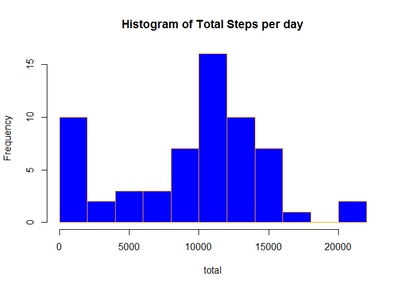
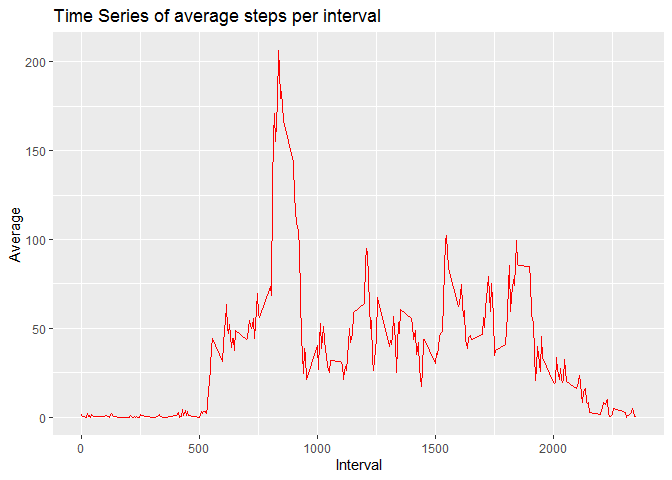
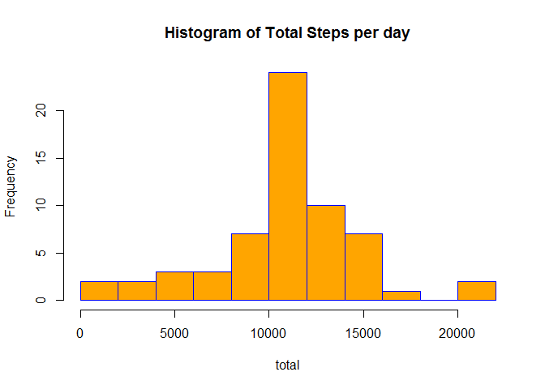
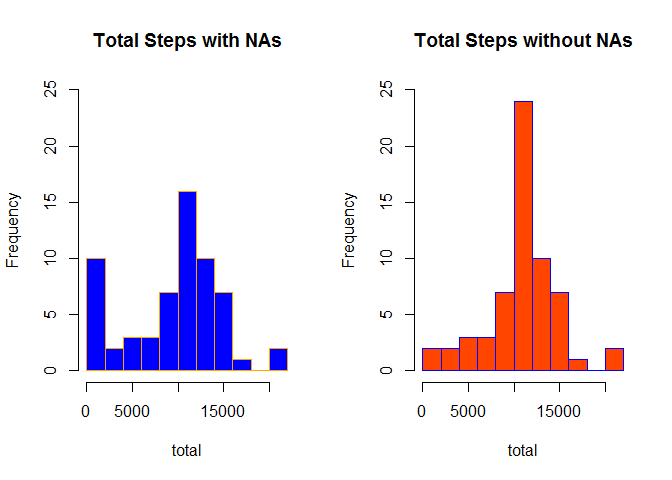
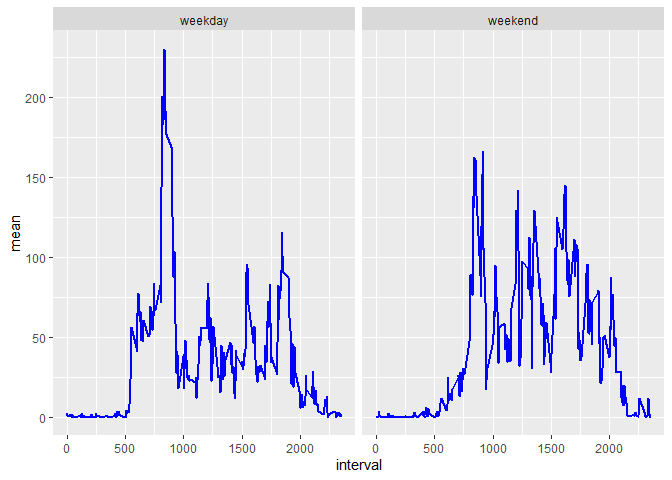

*Filipe M. Lima*

## Loading and preprocessing the data
Before load the data, we will load the ```dplyr``` and ```ggplot2```  libraries. 

```r
library(dplyr)
library(ggplot2)
```

Then, unzip and load the data. Then convert the ```date``` collumn into Date format. And then, group the dataframe by date, and summarize to get the total, mean, median, minimum and maximum steps per date.


```r
unzip("activity.zip",exdir="./data")
data <- read.csv("./data/activity.csv")
data$date <- as.Date(data$date)
summary_data <- data %>% group_by(date) %>%
  summarise(total=sum(steps,na.rm=T),mean=mean(steps,na.rm = T),
            median=median(steps,na.rm = T),
            maximum=max(steps),minimum=min(steps),.groups = 'drop')
```

Then we will look at the first five rows in this new dataset

```r
head(summary_data)
```

```
## # A tibble: 6 x 6
##   date       total    mean median maximum minimum
##   <date>     <int>   <dbl>  <dbl>   <int>   <int>
## 1 2012-10-01     0 NaN         NA      NA      NA
## 2 2012-10-02   126   0.438      0     117       0
## 3 2012-10-03 11352  39.4        0     613       0
## 4 2012-10-04 12116  42.1        0     547       0
## 5 2012-10-05 13294  46.2        0     555       0
## 6 2012-10-06 15420  53.5        0     526       0
```
## What is mean total number of steps taken per day?

The histogram of total steps per day is given by the next code

```r
with(summary_data,hist(total,breaks=10,main="Histogram of Total Steps per day",
                       col="blue",border="orange"))
```

<!-- -->

The mean and median total can be easily calculated by

```r
mean_total <- mean(summary_data$total,na.rm=T)
median_total <- median(summary_data$total,na.rm=T)
mean_total
```

```
## [1] 9354.23
```

```r
median_total
```

```
## [1] 10395
```

So, the mean total is 9354.2295082 and the median total is 10395.  

## What is the average daily activity pattern?

Now we are going to plot a time series of the average steps per interval. But first, we need to summarize our data grouped by interval. We will look to the first 5 lines of this new dataframe.


```r
interval_data <- data %>% group_by(interval) %>%
  summarise(total=sum(steps,na.rm=T),mean=mean(steps,na.rm = T),
            median=median(steps,na.rm = T),.groups = 'drop')
head(interval_data)            
```

```
## # A tibble: 6 x 4
##   interval total   mean median
##      <int> <int>  <dbl>  <int>
## 1        0    91 1.72        0
## 2        5    18 0.340       0
## 3       10     7 0.132       0
## 4       15     8 0.151       0
## 5       20     4 0.0755      0
## 6       25   111 2.09        0
```
To plot the time series needed, we are going to use the ```ggplot2``` library.


```r
qplot(interval,mean,data=interval_data,geom='line',
       xlab="Interval",main="Time Series of average steps per interval",
       ylab="Average",colour=I("red"))
```

<!-- -->

The interval that have on average the maximum number of steps can be found with the next line of code


```r
interval_data[which.max(interval_data$total),][[1]]
```

```
## [1] 835
```


## Imputing missing values

To determine the amount of NA's in the dataset, we can use the ```table``` function


```r
table(is.na(data$steps))
```

```
## 
## FALSE  TRUE 
## 15264  2304
```

So, the total number of missing values is 2304. That represents 13.11 percent of the whole dataset, so we will fill the missing the data using the mean of the interval. For that, we will use the values already calculated in ```interval_data```. So, we will begin creating ```data_filled``` using the main dataset. Then we will search for the indices of the rows that have na's, then save the interval where it happens, and retrieve the result from the ```interval_data``` dataset.


```r
data_filled <- data

for (i in which(is.na(data_filled$steps))){
  missedInterval <- data_filled[i,3]
  data_filled[i,1] <- interval_data[[which(interval_data$interval==missedInterval),3]]
}
```

As we can see below, this new dataset doesn't have any NA.


```r
table(is.na(data_filled$steps))
```

```
## 
## FALSE 
## 17568
```

Now, we are going to repeat the same initial analysis we did for the ```data``` dataset, now with the NA's filled.


```r
summary_data_filled <- data_filled %>% group_by(date) %>%
  summarise(total=sum(steps,na.rm=T),mean=mean(steps,na.rm = T),
            median=median(steps,na.rm = T),
            maximum=max(steps),minimum=min(steps),.groups = 'drop')
head(summary_data_filled)
```

```
## # A tibble: 6 x 6
##   date        total   mean median maximum minimum
##   <date>      <dbl>  <dbl>  <dbl>   <dbl>   <dbl>
## 1 2012-10-01 10766. 37.4     34.1    206.       0
## 2 2012-10-02   126   0.438    0      117        0
## 3 2012-10-03 11352  39.4      0      613        0
## 4 2012-10-04 12116  42.1      0      547        0
## 5 2012-10-05 13294  46.2      0      555        0
## 6 2012-10-06 15420  53.5      0      526        0
```

Plotting the histogram, we have


```r
with(summary_data_filled,hist(total,breaks=10,main="Histogram of Total Steps per day",
                       col="orange",border="blue"))
```

<!-- -->

Now, calculate the mean and the median of this new dataset


```r
mean_total_na <- mean(summary_data_filled$total,na.rm=T)
median_total_na <- median(summary_data_filled$total,na.rm=T)
mean_total_na
```

```
## [1] 10766.19
```

```r
median_total_na
```

```
## [1] 10766.19
```

In the first part, we had a mean of 9354.2295082 and a median of 10395. Now, both mean and median are 1.0766189\times 10^{4}. That is a rise of 15.0943396 percent in the mean, and 3.5708387 percent in the median.


Now, we are going to put the histogram with NA's and this one side by side to see if there are major differences.


```r
par(mfrow=c(1,2))
with(summary_data,hist(total,breaks=10,col=rgb(0,0,1),border="orange",
                       ylim = c(0,25),main="Total Steps with NAs"))
with(summary_data_filled,hist(total,breaks=10,col=rgb(255/255,69/255,0/255),
                              border="blue",ylim = c(0,25),main="Total Steps without NAs"))
```

<!-- -->

There are only apparent differences in the first and the sixth bars. That raises the question: How is the daily distribution of NA's. Using this code, we can see how many NA's are in each day.


```r
table(data[c(is.na(data$steps)),2])
```

```
## 
## 2012-10-01 2012-10-08 2012-11-01 2012-11-04 2012-11-09 2012-11-10 2012-11-14 
##        288        288        288        288        288        288        288 
## 2012-11-30 
##        288
```

So, actually there are NA's are distributed in 8 days, with the same amounth, which means the device was off the whole day.


## Are there differences in activity patterns between weekdays and weekends?

Now we will use the ```data_filled``` dataframe and create a factor variable which will say if the day is a weekday or a day of the weekend. This code will check which day of the week is the day written on *date*: If it's sunday (**domingo**) or saturday (**sábado**), will say that's a "weekend", otherwise, "weekday". Notice that the locale is "PT-BR", so, portuguese names for the days of the week. After that, will assign the new variable ```dayOfWeek``` as the factored vector ```weeks```.


```r
weeks <- c()
for (i in 1:length(data_filled$date)){
  if (weekdays(data_filled$date[i])=="domingo" | weekdays(data_filled$date[i])=="sábado"){
    day <- "weekend"
  } else{
    day <- "weekday"
  }
  weeks <- c(weeks,day)
}

data_filled$dayOfWeek <- as.factor(weeks)
head(data_filled)
```

```
##       steps       date interval dayOfWeek
## 1 1.7169811 2012-10-01        0   weekday
## 2 0.3396226 2012-10-01        5   weekday
## 3 0.1320755 2012-10-01       10   weekday
## 4 0.1509434 2012-10-01       15   weekday
## 5 0.0754717 2012-10-01       20   weekday
## 6 2.0943396 2012-10-01       25   weekday
```

Now, we will split that dataframe based on the factor variable dayOfWeek.


```r
splitted_data_filled <- split.data.frame(data_filled,data_filled$dayOfWeek)
```

Next, we will group the *weekday* part of the splitted data, group it by *interval*, and then summarize it. After that, create a *dayOfWeek* variable "weekday".

```r
interval_data_filled_weekday <- splitted_data_filled$weekday %>% group_by(interval) %>%
  summarise(total=sum(steps,na.rm=T),mean=mean(steps,na.rm = T),
            median=median(steps,na.rm = T),.groups = 'drop')
interval_data_filled_weekday$dayOfWeek <- as.factor(c(rep("weekday",each=288)))
```

We will do the analog with the *weekend* part.


```r
interval_data_filled_weekend <- splitted_data_filled$weekend %>% group_by(interval) %>%
  summarise(total=sum(steps,na.rm=T),mean=mean(steps,na.rm = T),
            median=median(steps,na.rm = T),.groups = 'drop')

interval_data_filled_weekend$dayOfWeek <- as.factor(c(rep("weekend",each=288)))
```

After that, use *rbind* to merge both datasets.


```r
full_data_weekday <- rbind(interval_data_filled_weekday,interval_data_filled_weekend)
head(full_data_weekday)
```

```
## # A tibble: 6 x 5
##   interval  total   mean median dayOfWeek
##      <int>  <dbl>  <dbl>  <dbl> <fct>    
## 1        0 101.   2.25        0 weekday  
## 2        5  20.0  0.445       0 weekday  
## 3       10   7.79 0.173       0 weekday  
## 4       15   8.91 0.198       0 weekday  
## 5       20   4.45 0.0990      0 weekday  
## 6       25  71.6  1.59        0 weekday
```


Now, we will plot both time series dividing then by *dayOfWeek* using the ```ggplot2``` plotting system.


```r
g <- ggplot(full_data_weekday,aes(interval,mean))
g+geom_line(color="blue",size=1)+facet_grid(.~dayOfWeek)
```

<!-- -->


